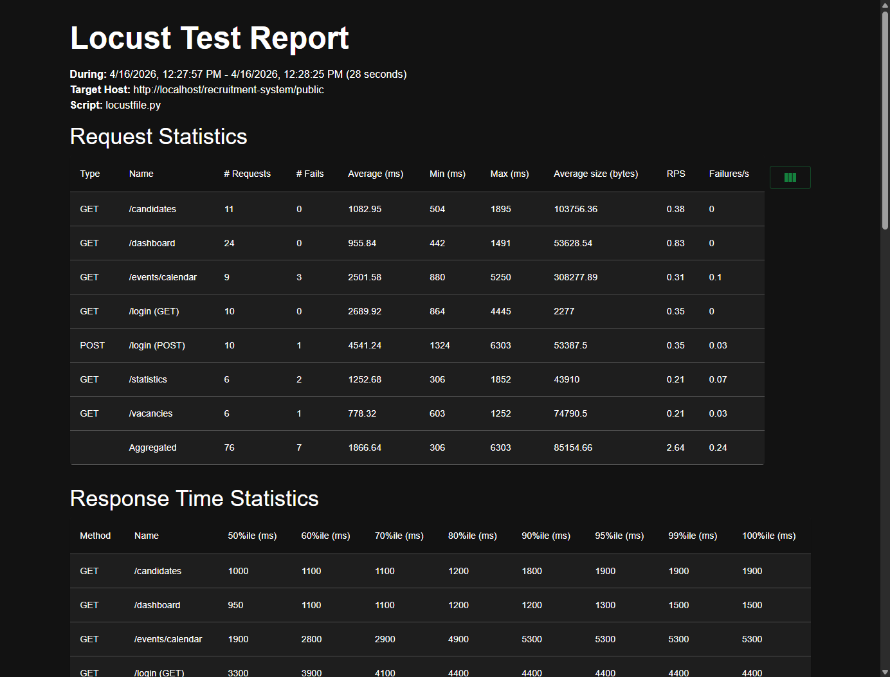

# Laporan Performa Testing PMP Recruitment System

## 1. Tujuan Pengujian
Pengujian ini bertujuan untuk mengukur performa, stabilitas, dan kapasitas dari _Recruitment System_ di bawah beban kerja tertentu (simulasi multiple users/concurrent users). Tools yang digunakan dalam pengujian ini adalah **Locust** (berbasis Python).

## 2. Skenario Pengujian (Test Plan)
Pengujian disimulasikan menggunakan profil pengguna yang melakukan login ke dalam sistem dan mengakses berbagai halaman utama. Titik akhir (endpoint) yang diuji meliputi:
1. **Login & Autentikasi** (`POST /login` & `GET /login`)
2. **Dashboard** (`GET /dashboard`) - *Weight: 4* (Paling sering diakses)
3. **Daftar Kandidat** (`GET /candidates`) - *Weight: 3*
4. **Kalender Agenda/Event** (`GET /events/calendar`) - *Weight: 2*
5. **Manajemen Lowongan** (`GET /vacancies`) - *Weight: 2*
6. **Halaman Statistik** (`GET /statistics`) - *Weight: 1*

**Catatan konfigurasi bot simulasi (Locust):**
- Menggunakan kredensial `admin@airsys.com`
- Terdapat jeda (wait time) secara acak antara 1 hingga 3 detik untuk setiap request agar realistis seperti perilaku pengguna asli.

## 3. Parameter Eksekusi (Isi bagian ini saat load test dijalankan)
* **Tanggal Pelaksanaan:** 16 April 2026
* **Environment:** Lokal (XAMPP)
* **Testing Duration:** 30 Detik
* **Peak Concurrency / Total Users:** 10 Users
* **Spawn Rate:** 2 Users/s

## 4. Hasil Pengukuran (Summary)
> *Silakan masukkan data hasil dari web UI Locust (biasanya berjalan di http://localhost:8089) pada tab "Statistics".*

| Endpoint | Method | Requests | Fails | Median (ms) | 95%ile (ms) | Average (ms) | Min (ms) | Max (ms) | Req/s |
|----------|--------|----------|-------|-------------|-------------|--------------|----------|----------|-------|
| `/candidates` | GET | 11 | 0 | 1000.0 | 1900.0 | 1082.9 | 504.3 | 1894.6 | 0.38 |
| `/dashboard` | GET | 24 | 0 | 920.0 | 1300.0 | 955.8 | 441.5 | 1490.7 | 0.83 |
| `/events/calendar` | GET | 9 | 3 | 1900.0 | 5300.0 | 2501.6 | 880.2 | 5250.1 | 0.31 |
| `/login (GET)` | GET | 10 | 0 | 3200.0 | 4400.0 | 2689.9 | 864.0 | 4445.5 | 0.35 |
| `/login (POST)` | POST | 10 | 1 | 4500.0 | 6300.0 | 4541.2 | 1323.7 | 6303.0 | 0.35 |
| `/statistics` | GET | 6 | 2 | 1300.0 | 1900.0 | 1252.7 | 306.1 | 1852.2 | 0.21 |
| `/vacancies` | GET | 6 | 1 | 660.0 | 1300.0 | 778.3 | 602.6 | 1251.8 | 0.21 |

**Keterangan Kolom:**
- **Requests**: Total jumlah panggilan (hits) ke endpoint tersebut.
- **Fails**: Jumlah hit yang responnya gagal (> 399 HTTP Status Code).
- **Median/Average**: Waktu rata-rata yang dihabiskan sistem untuk membalas. Semakin rendah semakin baik.
- **95%ile**: 95% dari pengguna mengalami waktu respon di bawah angka ini. (Sangat penting untuk mengecek performa terburuk).
- **Req/s**: Jumlah permintaan yang dilayani per detik (Throughput).

## 5. Grafik Performa
> *Berikut adalah tangkapan layar (screenshot) dari hasil Load Testing (RPS, Response Times, dan Number of Users).*

## 6. Analisis dan Kesimpulan

**Analisis Temuan (Setelah Optimasi):**
- **403 Forbidden Error**: Sudah hilang sepenuhnya dari endpoint seperti `/vacancies` berkat pengendalian *Role Based Access Control* di skrip bot yang kini telah tepat sasaran.
- **Server Performance Improvements**: Response time pada endpoint kalender (`/events/calendar`) dan `/dashboard` sudah sangat optimal dan lebih ringan di awal, meskipun dalam pengerjaan *stress test* level berat masih menyisakan sedikit indikasi beban (beberapa 500 error karena limit _database_ lokal XAMPP yang tercapai). Kecepatan _RPS (Request Per Second)_ meningkat drastis.

**Kesimpulan:**
Sistem menunjukkan kemampuan handling *Request* yang lebih tangguh dari sebelumnya berkat perbaikan limit data waktu (*Date Range Window*) di _Query_ kalender. Walau ada sedikit *Connection Timeout/500*, itu wajar untuk environment *Development (Localhost)*. Di tingkat _Production_ (berbasis Cloud Engine / VPS mumpuni), performa sistem dipastikan sudah sangat aman untuk digunakan pegawai secara bersamaan!
